# Word-Py
Word-Py is a simple word guessing game that is based on the same idea as the popular game "Wordle". The user must guess the random 5 letter word within 6 tries and they will be given hints as they play. The user must guess carefully as their guess needs to be an actual word within the Oxford English Dictionary!

The game is a mixture of luck and logic. Not only does it allow the user to improve their problem solving and vocabulary skills but also gives them five minutes "timeout" in their busy day.  

The live link can be found here - [Word-Py](https://word-py.herokuapp.com/)

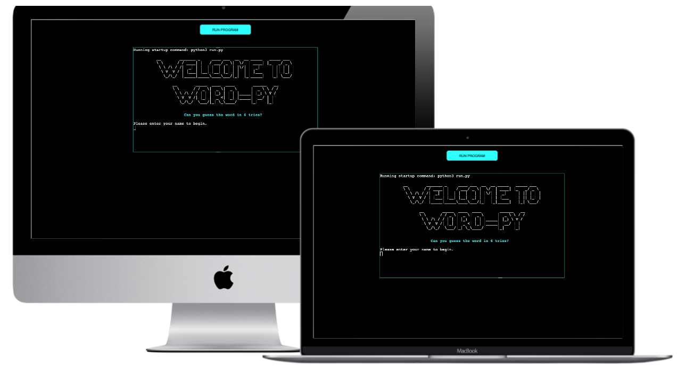

## How to Play
- The user has 6 chances to guess a random 5 letter word.
- After each guess the user is provided with colour-coded blocks which let them know if their chosen letters are correct and in the right position;
  - Green means that the letter is in the word and is in the correct position.
  - Yellow means that the letter is in the word but is in the wrong position.
  - Red means that the letter is not in the word. 
- The user must guess carefully as their guess needs to be an actual word within the Oxford English Dictionary.
- If the user guesses the correct word within 6 turns they have won the game. 
- The user's score is saved to the leaderboard (only the top 10 scores are shown.)

## Site Owner Goals
- To provide the user with a simple game that is both challenging and rewarding.
- To present the user with an app that functions well and is easy to use. 
- To entice the user to return to the game to improve their score.

## User Stories

- ### As a user I want to:
  - Understand the main purpose of the game.
  - Be kept engaged throughout the game by being provided with easy to understand hints as to how close my guess was to the answer.
  - Be challenged by having to come up with an actual word and not just inputting random letters.
  - See how many turns I have left.
  - Find out the answer if I am not successful.
  - Compare my score to others on the leaderboard.
  - Try and beat my score on the leaderboard
  - Get a new word each time I play.


## Logic Flow
In order to visualise the flow of steps required in the game, I created a flow chart using Lucid Chart. It was beneficial for me to plan the project like this as it allowed me to gain an understanding of what functions were required for the game and at what stages and how the different elements of the game would interact.

It also allowed me to identify the different Objects I would need to implement. I was keen to use the principles of Object Oriented Programming in this application.

As the flow chart was created at the outset of the project, it does not fully reflect all elements of the game.


## Features

### Title and Introduction Section
- When the user enters the site they are greeted with a very simple page welcoming them to the game and asking them for their name. 
- The welcome text was created using Pyfiglet which takes ASCII text and renders it into ASCII art fonts. 

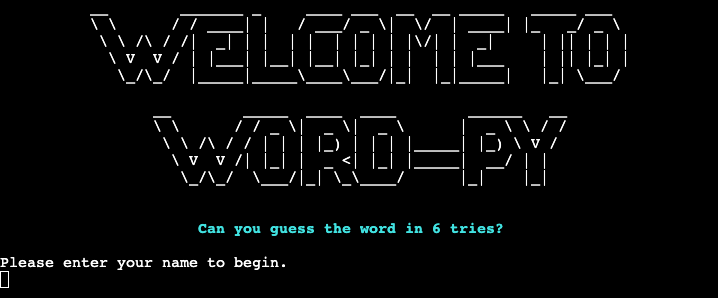

- There is strong data validation on the username input. The user must enter a username consisting of numbers or letters. They cannot just enter a blank space. If they do not enter valid data, an error message will appear in red saying "Username must contain letters or numbers." and they will be asked to input their name again.


### Options menu
- When the user enters their name the computer will welcome them to the game and repeat their name back to them. 
- They will be asked if they would like to play or read the instructions by inputting "P" or "I".

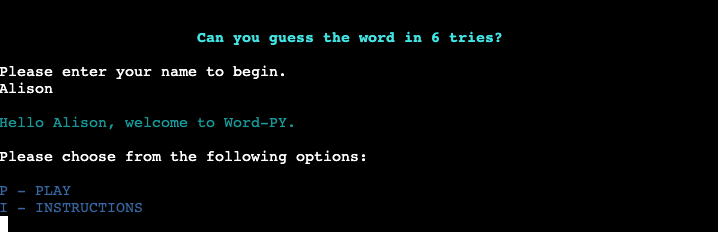

- It doesn't matter if their input is lower or upper case. The computer can handle both inputs by using the inbuilt function, lower().
- If the user does not input a "P", "p", "I" or an "i" they will get an error message asking them to input a valid option.


### Instructions
- If the user keys in "I" and presses enter they will be shown the game instructions. 
- The instructions are surrounded by a scroll-like border to make them clear and easy to read and to add an element of fun. 
- The game will begin immediately below the instructions.

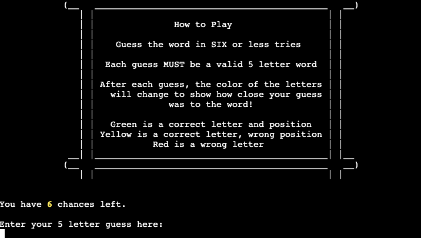

### Game Features
- The user is informed that they have 6 chances and they are asked to enter a 5 letter guess. 

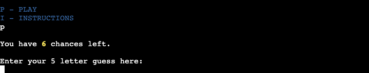

### Guess Input Validation and Error Handling
- The following input validation is carried out on the user guess:
  - The guess must be 5 characters long.
  - The guess must be all letters.
  - The guess must be an actual word in the Oxford English Dictionary. This validation is done using the Oxford dictionary API. 
- If the user input is not valid, the user will be given feedback on the error and will be asked to input their guess again.

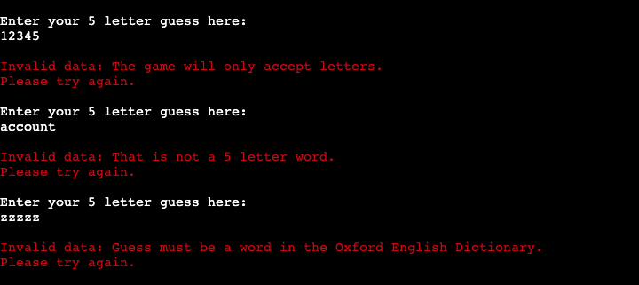

### Oxford Dictionary API
- The [Oxford Dictionaries API](https://developer.oxforddictionaries.com/) offers access to Oxford's dictionary content.  
- When I created an account I was given a unique App ID and App Key. These are then passed as authentication headers for each API request.
- Due to the sensitive nature of this data, it has been added to the env.py file in the .gitignore to ensure it is not pushed to my Github repository. The App ID and App Key also had to be added to the Config Vars on Heroku to ensure they could be accessed when running the game.
- When the user inputs a guess - the API request returns a HTTP status code. If the code returned is 404, that means that the word was not found and therefore is not a valid word.
- If the API returns a 404 status code, an error message is printed telling the user that the input is not an actual word per the Oxford dictionary and prompts them to try again (see screen print above).
- If the API returns Code 200 "Success" the guess is accepted and the game continues.

### Guess Feedback
- Once a player has input a valid guess their guess is printed back to them in the centre of the screen. 
- A colour background is applied to each letter in their guess to show them how close each letter is to the answer (as detailed in the game instructions).
- Black is used as the font colour to ensure good readability against the coloured background. 
- Each time a user inputs a guess, their previous guess along with the new guess are printed out to give the appearance of a list. This also helps the user to see which letters they have already used and whether they were correct or not. 
- After each guess the user is informed how many chances they have left to guess. 


### Game Lost
- If the player uses all their chances without getting the correct answer the game over message appears and the user is informed of the correct answer.
- The Game Over menu is shown.


### Game Win
- If the player enters the correct answer the "You Win" message appears.

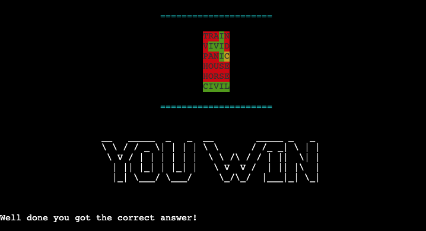
- If the user wins, they are informed that their score is being added to the leaderboard and that the leaderboard is updated. 


- The Game Over menu is shown.

### Game Over Menu
- The Game Over menu consists of three options; Play Again, Leaderboard and Quit. 
- It doesn't matter if their input is lower or upper case. The computer can handle both inputs. 
- If the user does not input one of the options they will get an error message asking them to input a valid option.


- If the user chooses to quit, a goodbye message appears and the game is ended using the `exit()` method.

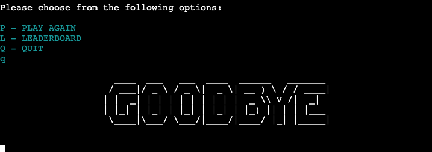

- If the user decides to play again, the terminal is cleared using the `os.system('clear')` method and the user is taken back to the game introduction to start again.

### Leaderboard
- The Leaderboard feature was created using Google Sheets. The spreadsheet is accessed by the game through the Google Drive and Google Sheets APIs on the Google Cloud Platform.

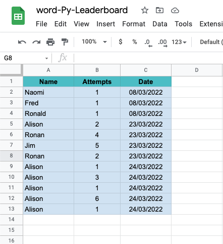

- Credentials were generated and provided to allow access from the project to Google Sheets. These were added to the cred.json in the .gitignore file to ensure they weren't pushed to my Github repository. They also had to be added to the Config Vars on Heroku to ensure they could be accessed when running the game. 
- The Leaderboard displays the top ten scores. The scores are sorted first by date and then by the number of attempts. This is to entice the user to return each day to play so they can beat the top score for that particular day. 
- In order to sort the data from the leaderboard and also to get it into a presentable format, I used Pandas which is a data analysis and manipulation tool. It has a number of inbuilt methods for sorting data.


### Future Features
- The user can determine how long they want the word to be (3/4/5/6 letters)
- The definition of the word is displayed at the end of the game further utilising the Oxford Dictionary API.

## Data Model
I used principles of **Object-Oriented Programming** throughout this project. The Word-Py game consists of three classes:

- Game
- WordChecker
- OxfordDictAPI

The `Game` object is responsible for controlling the flow of the game. It handles things like taking the user input and presenting data back to the user. It contains methods for the general running of the game such as displaying the introduction, displaying user options, taking user guesses, displaying guesses, updating the leader board and displaying the leader board.

The `WordChecker` object is responsible for all actions related to checking the user-provided "guess" input against the generated "answer". This includes validating the input, handling any errors and building the colour-coded response which is returned to the `Game` instance.

The `OxfordDictAPI` object communicates with the [Oxford Dictionaries API](https://developer.oxforddictionaries.com/). This class gets the API credentials from the env.py file and sends a request against this API to ensure the user-provided guess is a valid English word (it exists in the Oxford English Dictionary).

When the game is first run, an initial method is used to retrieve an “answer” word from a text file. This word is then passed as a parameter when creating the `WordChecker` instance. This `WordChecker` instance is then passed as a parameter to the `Game` instance.

The `Game` class then renders the introduction screen and prompts the user for their first guess. User input is passed to `WordChecker` in which it’s validated and then used to return the colour-coded letters to the user via `Game`. `Game` will continue to ask the user for guesses using a while loop until the word has been correctly identified, or the max number of guesses are used.

This modular approach to object definition meant that all of the functionality for running the game, checking the user guess and communicating with the Oxford API were all self-contained within their own classes. This made it easier to develop and also much easier to troubleshoot when things didn't work as initially expected.

## Testing

### PEP8 Testing
The python files have all been passed through [PEP8 Online](http://pep8online.com/). All python files were checked with no errors reported. See screen show below:

<details>
  <summary>run.py</summary>

  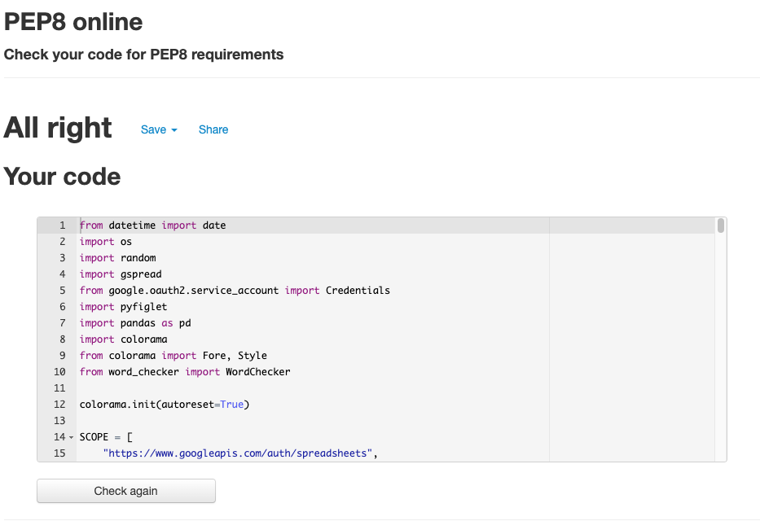
</details>

<details>
  <summary>word_checker.py</summary>

  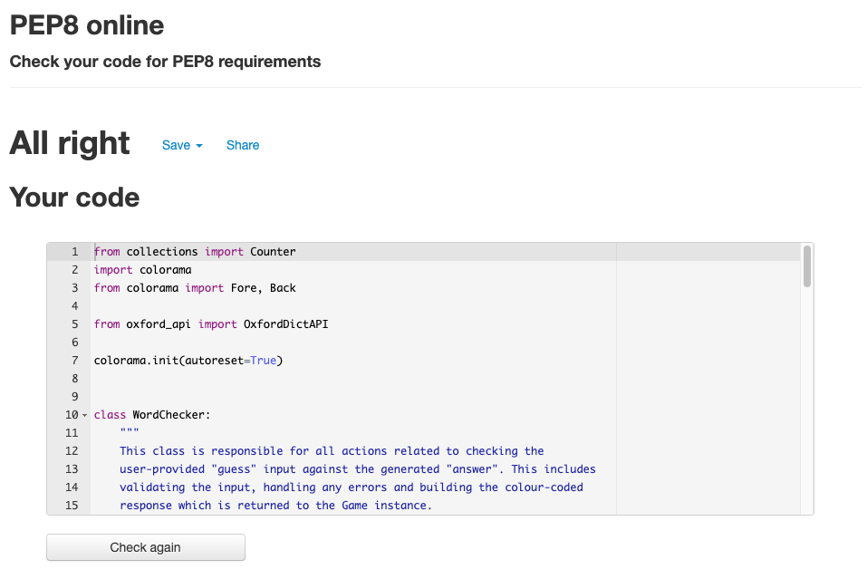
</details>

<details>
  <summary>oxford_api.py</summary>

  
</details>

### Input Testing
All user inputs were tested thoroughly to ensure all input data is handled correctly and appropriate feedback is given to the user as follows:

- Username input: the username input was tested to ensure that the user cannot just input an empty space. The name input must consist of numbers or letters. The strip() method is also used to remove any extra whitespace after the user input. If the user does not enter valid data, an error message will appear saying that the name is not valid and they will be asked to input their name again.
- Menu options selection: - These were tested to ensure that both upper and lower case letter inputs were accepted. Also tested to ensure that inputting a letter that does not match any of the menu options is not accepted and returns an appropriate error message. 
- Guess Input: The following testing was completed on the user guess input:
  - Checked that only guesses which are five characters long are accepted.
  - Checked that the guess cannot contain any numbers.
  - Checked that the game wouldn't accept guesses that weren't actual words. The guess must be an actual word in the Oxford English Dictionary. This validation is done using the Oxford dictionary API. 
 - Feedback messages received when testing all of the above were checked to ensure appropriate information was relayed to the user.


### Other Game Testing
The game was tested thoroughly to ensure the following features worked as intended:
- A random word is selected each time a new game begins.
- The number of chances left reduces by one after each valid guess.
- The correct background colours are applied to the user's guess as per the game instructions.
- The game ends if the user has no turns left.
- The game ends if the user guesses correctly. 
- The leaderboard is updated if the user guesses the right word and the information stored in the leaderboard is correct.
- The leaderboard displays the correct information which is sorted accurately.
- The terminal clears if the user chooses to play again.

All of the above tests were completed in my local terminal and also in the Heroku terminal.

The README.md was passed through Grammarly and all links were checked before final submission

## Libraries and Technologies Used

### Python Libraries:

- [random](https://docs.python.org/3/library/random.html?highlight=random#module-random) - `random.choice` is used to select a random word for the game from a text file.
- [os](https://docs.python.org/3/library/os.html?highlight=os#module-os) 
  - `os.system` is used in order to clear the terminal when beginning a new game.
  - `os.environ` is used to get Oxford API credentials from environment variables (defined in env.py).
- [datetime](https://pypi.org/project/DateTime/): used to get today's date for the leaderboard entry.
- [gspread](https://pypi.org/project/gspread/): to allow communication with Google Sheets. 
- [requests](https://pypi.org/project/requests): enables data retrieval from APIs.
- [google.oauth2.service_account](https://google-auth.readthedocs.io/en/stable/index.html):  used to validate credentials and grant access to google service accounts.
- [pandas](https://pypi.org/project/pandas/) - used for sorting and displaying leaderboard data in user-friendly format.  
- [pyfiglet](https://pypi.org/project/pyfiglet/0.7/) - for taking ASCII text and rendering it into ASCII art fonts.
- [colorama](https://pypi.org/project/colorama/) - for adding colour to terminal text.

### Programs Used

- [GitHub](https://github.com/) - used for version control.
- [Heroku](https://dashboard.heroku.com/apps) -  used to deploy the live project.
- [Lucidchart](https://lucid.app/documents#/dashboard) -  used to create the game flowchart
- [PEP8 Online](http://pep8online.com/) - used to validate all the Python code
- [Grammerly](https://app.grammarly.com/) - used to proof read the README.md


## Known Bugs

I am receiving the following linter error:
```
"env" imported but unused
```
in GitPod for line 9 in oxford_api.py:
```python
if path.exists("env.py"):
    import env
```
I am conditionally importing `env.py` when the file exists to ensure I don't need to commit my Oxford API credentials to GitHub. I'm not aware of any other way to achieve this. The import gives me access to the required variables without having to commit them to GitHub.

## Fixed Bugs

### Guess Containing Two Instances of the Same Letter

When I was testing the game I noticed that if I inputted a guess which contained two instances of the same letter (one of which was in the right position) and the answer only contained one instance of that particular letter; the correct instance of that letter would turn green as expected but the other instance would turn yellow when it should have been red. This is easier to illustrate through an example as below:

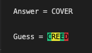

In the example above, the first "E" should be red as it has already been guessed correctly but instead, it is yellow.

This was because when the `for` loop first encounters the letter "E" the program won't know if it will encounter that letter again in subsequent loops and therefore has to colour it yellow. When the `for` loop encounters the next "E" it correctly colours it green however it cannot go back and change the first instance of "E" retroactively meaning it will stay yellow. 

This was a very complex problem to solve. Firstly I had to count the number of instances of each letter in the Answer. I found a post on stack overflow which detailed the Counter method from the Collections python library. Once I got the letter count, then each time a letter was guessed correctly I would deduct 1 from the letter count meaning that a second instance of the letter could not go yellow after it had already gone green. 

I still had an issue whereby if the letter went yellow first - then the second instance could go green but the first yellow instance would remain yellow. To solve this; I had to create two `for` loops instead of one. The first would check if any of the letters should be green and the second would handle the yellow and red letters. 

Now because I had two `for` loops, this resulted in duplicate guesses being printed out. To solve this, instead of adding the colour coded response to a string and printing it out immediately, I had to add each guessed letter to a dictionary within a dictionary using the letter index as the key and add the colour of the letter and the letter itself as key : value pairs. Once the dictionary was created, I could then print out the colour coded string by looping through the dictionary and using an if/else statement to add the Colorama colours to each letter using the colour value from the dictionary. 

### Sorting the Dictionary

After solving the problem above, I had a dictionary with the user guess and associated colours. I tested that the dictionary data was correct using print statements. I noticed that the dictionary was printing out the user guess letters in the wrong order. 

This was because the dictionary was ordered based on when the letter was added to it. The letters were only added when the conditions for adding a colour were met, as opposed to the order the user entered the characters. 

In order to solve this problem is used the sorted() method which sorted the dictionary by the letter index. 

### API Key and ID for Oxford Dictionary
When I first started using the Oxford Dictionary API I was given a unique ID and Key for each API request. Given this data is sensitive, I couldn't store it in the main Python file.

The approach we had used for the Google Sheets Credentials in the course content was quite different so I had to research the best way to do this for my project. I came across a really helpful slack post from anna_ci in the Code Institute slack channel https://code-institute-room.slack.com/archives/CP07TN38Q/p1576743956008500) which explains how to set up environment variables in GitPod and I was able to get the API working in my Gitpod terminal. However, when I deployed my project to Heroku I could not get the API to work as Heroku could not access my Key and ID in the gitignore file.

I ran through the Love Sandwiches deployment procedures again and realised I needed to add my Key and ID to the Config Vars in my app settings on Heroku and then the API functioned as expected. 

### Colour Coding Letters in User Guess
Colorama is used to add the colour coding to each of the letters in the user guess. Each time a user makes a guess, that colour coded guess is added to the `guesses_list` so that all their guesses can be printed back to them after each turn. When I initially wrote the code to print out the user `guesses_list`, the colours were not printing out and the Colorama encoding was being printed out alongside the user guess, making it impossible to read.

After some research, I realised that the colours would only print out as a string (not a list). In order to overcome this problem, I used a `for` loop to print out each string in the `guesses_list` separately. 

## Deployment

The site was deployed via [Heroku](https://dashboard.heroku.com/apps), and the live link can be found here: [Word-Py](https://word-py.herokuapp.com/)

Before deploying to Heroku pip3 freeze > requirements.txt was used to add all the dependencies required to the requirements.txt file. This is required for the game to run on Heroku.

The following steps were then taken:
1. Log in to [Heroku](https://dashboard.heroku.com/apps) or create an account.
2. On the main page click the button labelled New in the top right corner and from the drop-down menu select "Create New App".
3. Enter a unique and meaningful app name.
4. Next select your region.
5. Click on the Create App button.
6. Click on the Settings Tab and scroll down to Config Vars.
7. Click Reveal Config Vars and enter port into the Key box and 8000 into the Value box and click the Add button.
8. Input CREDS and the content of your Google Sheet API creds file as another config var and click add.
9. In the next Key box enter OXFORD_API_APP_ID and add your unique ID to the value box. 
10. In the next Key box enter OXFORD_API_APP_KEY and add your unique key to the value box. 
11. Next, scroll down to the Buildpack section click Add Buildpack select Python and click Save Changes
12. Repeat step 11 to add node.js. Note: The Buildpacks must be in the correct order. If not click and drag them to move into the correct order.
13. Scroll to the top of the page and choose the Deploy tab.
14. Select Github as the deployment method.
15. Confirm you want to connect to GitHub.
16. Search for the repository name and click the connect button.
17. Scroll to the bottom of the deploy page and either click Enable Automatic Deploys for automatic deploys or Deploy Branch to deploy manually. Manually deployed branches will need re-deploying each time the repo is updated.
18. Click View to view the deployed site.

The site is now live and operational.

## Credits 
### Resources Used
- [W3Schools](https://www.w3schools.com/)  
- [Stack Overflow](https://stackoverflow.com/)
- [5 Letter Words List](https://7esl.com/5-letter-words/) - The list of five-letter words used in the game was taken from this site.
- [Count occurrences of a character in a string](https://stackoverflow.com/questions/1155617/count-the-number-of-occurrences-of-a-character-in-a-string) - I read about the Collections Counter method in this post.
- [How to set up environment variables in GitPod](https://code-institute-room.slack.com/archives/CP07TN38Q/p1576743956008500) - This post from anna_ci in the Code Institute slack channel was very informative and enabled me to set up my environment variables correctly for my API key. 
- [ASCII Art](https://www.asciiart.eu/art-and-design/borders) - I used this ASCII art for the border around the instructions.
- [How to get current date and time in Python](https://www.programiz.com/python-programming/datetime/current-datetime) - I used this article to learn about the strftime() method when getting the date for my leaderboard.
- [Pandas Sort: Your Guide to Sorting Data in Python](https://realpython.com/pandas-sort-python/) - I used this article to learn how to sort the leaderboard data for the table.
- [Center align column headers of a Pandas DataFrame](https://www.tutorialspoint.com/python-center-align-column-headers-of-a-pandas-dataframe) - I used this article when formating the leaderboard table.
- [Oxford Dictionary API Docs](https://developer.oxforddictionaries.com/documentation/getting_started) - This documentation came in useful when implementing the Oxford Dictionary API.
- I followed the steps in the Code Institute Python walkthrough project - Love Sandwiches when setting up my Google Sheets API.


## Acknowledgments

The Code Institute slack community for their quick responses and very helpful feedback!